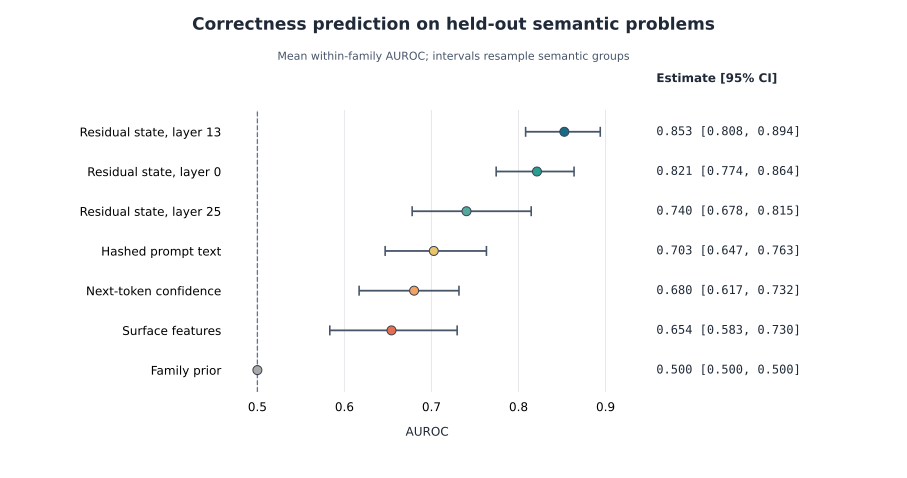
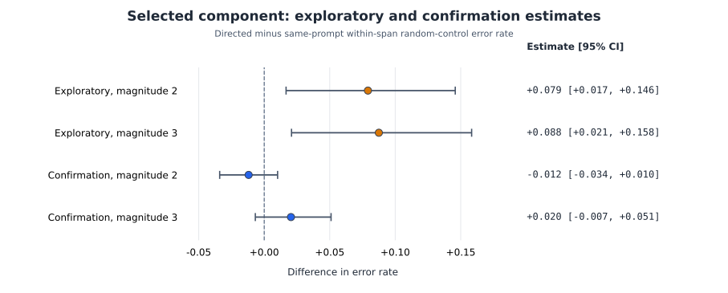

# Correctness Probes and Activation Interventions in Gemma 2 2B

**Technical writeup accompanying the repository — not peer reviewed**  
**Author:** Kyler Gelissen

## Abstract

Linear probes can predict language-model errors, but it is unclear whether
their decision directions identify variables the model uses causally. We study
greedy generations from Gemma 2 2B on a controlled synthetic benchmark whose
underlying problems appear in multiple paraphrases. After conservatively
excluding 185 cached prompts with task or label inconsistencies, correcting an
arithmetic parser failure found by human audit, and holding out complete
semantic problems, a linear probe on the final prompt-token residual state
reaches **0.853 mean within-family AUROC** at layer 13 (semantic-group bootstrap
95% CI 0.808–0.894). Hashed prompt text reaches 0.703, next-token confidence
0.680, and hand-built surface features 0.654 on the same 830 examples. We also
reanalyze exploratory additive interventions using same-prompt random-direction
controls. No searched effect survives Holm correction, and the selected
component fails a larger confirmation. The results show that first-answer
correctness is linearly predictable before generation in this setting, while
cautioning that a probe's predictive direction need not be a privileged control
direction. The conclusions are limited to one base model, synthetic tasks,
frequently repetitive continuations, and the tested additive interventions.

## 1. Introduction

A linear probe answers a correlational question: can a label be predicted from
a model state? It is tempting to give the probe weight a stronger
interpretation. If the weight separates correct and incorrect examples, perhaps
moving the residual stream along that weight will make an answer more or less
correct. That interpretation would turn an inexpensive monitor into a control
mechanism, but it does not follow from classification accuracy alone.

We test the gap between readout and control in a small, deliberately constrained
setting. Gemma 2 2B receives synthetic arithmetic and logical-reasoning prompts.
Each underlying problem appears in several surface forms. We read the residual
state at the final prompt token, before the model generates an answer, and ask
whether a linear probe predicts the correctness of its first committed answer.
The key evaluation rule is that all paraphrases of an underlying problem remain
in the same cross-validation fold. This prevents the probe from seeing one
wording of almost every test problem during training, a severe flaw in our
original random split.

We then ask the causal question separately. Probe-derived directions are added
to the residual stream and compared with norm- and subspace-matched random
directions. The existing intervention series was exploratory and used a
direction fit on data that included the tested prompts, so it cannot support a
clean causal estimate. It can, however, answer whether the originally reported
effect survives prompt-clustered statistics and confirmation. It does not.

The contributions are:

1. a semantic-task-disjoint evaluation of pre-generation correctness probes;
2. direct comparison with prompt-text, prompt-surface, family-prior, and
   next-token-confidence baselines;
3. a human audit that separates first-answer correctness from generation
   degeneration and exposes benchmark and parser failures; and
4. a matched-control reanalysis showing why a predictive direction should not
   be called a causal correctness variable without a held-out intervention.

The result is intentionally narrow. We do not claim that the model is aware of
its future error, that correctness has no causal representation, or that linear
activation steering generally fails.

## 2. Related work

### 2.1 Predicting correctness and uncertainty

Question-only linear probes can predict answer accuracy before generation
[Cencerrado et al., 2025], making that paper the nearest precedent for our
predictive experiment. It studies 7B–70B models across knowledge datasets and
reports weaker generalization on mathematical reasoning. Sun et al. [2025]
decode arithmetic errors from hidden states and use detectors for selective
re-prompting. Yuan et al. [2026] probe generated chain-of-thought states and
report strong error prediction alongside failed steering, self-correction,
best-of-N, and patching interventions. Our setting differs in reading the state
before generation and in comparing directed interventions against matched
random directions, but the broad result is closely related.

Behavioral self-evaluation provides an important comparator. Kadavath et al.
[2022] show that models can sometimes report calibrated probabilities that
their answers are correct. Burns et al. [2022] recover truth-related directions
without outcome labels, while Marks and Tegmark [2023] find transferable linear
truth structure and positive causal interventions. These results motivate
separating eventual correctness, confidence, factual truth, and causal use.

### 2.2 What a probe establishes

Probe performance can reflect information in a representation, the capacity of
the probe, or regularities in the dataset. Hewitt and Liang [2019] introduce
control tasks for separating representation quality from probe memorization;
Belinkov [2022] reviews the broader methodological debate. Ravichander et al.
[2021] show that a property can be encoded even when the model does not need it
for its task. Elazar et al. [2021] therefore advocate behavioral tests that
remove decodable information and compare against random subspace removal. Our
matched-direction logic follows the same basic principle: disruption from an
arbitrary off-distribution perturbation is not evidence that the learned
direction is special.

### 2.3 Activation intervention

Several methods obtain useful behavioral control by modifying hidden states.
Inference-Time Intervention selects attention heads with truth probes and
shifts their activations [Li et al., 2023]. Activation Addition and Contrastive
Activation Addition derive residual-stream directions from contrastive prompts
[Turner et al., 2023; Panickssery et al., 2023]. Representation Engineering
places such reading and control methods in a broader framework [Zou et al.,
2023]. Positive results in these settings make a probe-derived correctness
direction plausible, but not automatic. Activation-patching conclusions can
depend strongly on corruption, metric, and intervention details [Zhang and
Nanda, 2023], and causal localization need not identify the best place to edit
[Hase et al., 2023].

A broader, checked reading map with 32 relevant papers and technical articles is
available in `docs/related_work.md`.

## 3. Methods

### 3.1 Model and generation

We use the base `google/gemma-2-2b` checkpoint, not the instruction-tuned
variant. The only locally cached Hugging Face revision is
`c5ebcd40d208330abc697524c919956e692655cf`; original run metadata did not store
the revision, so this is the best available reconstruction and is pinned for
future captures. Prompts are tokenized with the matching tokenizer. Generation
is greedy for at most 32 new tokens, with cached activations captured in
bfloat16 and seed 42. Because decoding is greedy, each prompt has one
deterministic continuation under the recorded environment.

### 3.2 Benchmark and exclusions

The original benchmark contains 1,246 prompts across eight task families. The
recoverable local activation archive covers 1,015 prompts and six families:
arithmetic, multi-step arithmetic, relational reasoning, set inclusion,
syllogistic reasoning, and contradiction detection. Prompts are grouped by
`semantic_task_id`; a group contains multiple surface forms of the same
underlying problem.

A code and human audit found four systematic prompt-generation failures and
five individual operand-reversing subtraction prompts. We exclude 185 cached
runs using the declarative manifest in
`data/prompts/benchmark_v2_exclusions.json`. The retained population contains
830 prompts from 190 semantic groups: 456 are labelled correct and 374
incorrect.

| Family | Examples | Correct | Incorrect |
| --- | ---: | ---: | ---: |
| Arithmetic | 145 | 56 | 89 |
| Multi-step arithmetic | 120 | 41 | 79 |
| Relational | 300 | 199 | 101 |
| Set inclusion | 50 | 10 | 40 |
| Syllogistic | 140 | 131 | 9 |
| Contradiction | 75 | 19 | 56 |
| **Total** | **830** | **456** | **374** |

The outcome label records whether the first answer-bearing span matches the
reference answer. This deliberately does not grade the quality of everything
that follows. For a prompt such as `11 - 8 =`, a continuation whose first
equation gives 3 is labelled correct even if later text drifts into unrelated
arithmetic.

### 3.3 Human audit

We sampled 25 outputs from each retained task family, stratified by the
automated parser's verdict and preferring distinct semantic tasks. The reviewer
was not shown probe scores or parser verdicts. For each row, the reviewer marked
first-answer correctness, extracted answer, and output validity (`clean`,
`prompt_echo`, `degenerate`, or `uninterpretable`).

The raw pass contained 74 `yes`, 64 `no`, and 12 `ambiguous` judgments. After a
written adjudication rule was applied, four malformed prompts remained
ambiguous and were covered by the exclusion manifest. The parser agreed on
144/146 evaluable rows. Both disagreements were arithmetic outputs in which the
first equation was correct but the parser selected a later equation; the parser
was changed to select the first answer-bearing equation. Because sampling was
stratified by the parser verdict, this agreement is a diagnostic check rather
than a population error-rate estimate.

Only 30/150 reviewed generations were clean; 112 were marked degenerate and 8
prompt echoes. This does not invalidate the first-answer target, but it sharply
limits any claim about overall reasoning quality.

### 3.4 Probe features and training

For each retained prompt we read the final prompt-token residual state after
transformer blocks 0, 13, and 25. Each state has 2,304 dimensions. Within each
cross-validation fold, every feature is standardized using training-fold mean
and standard deviation. A single linear layer is then fit with full-batch AdamW
and binary cross-entropy for 400 epochs (learning rate 0.01, weight decay
0.001). The probe predicts the probability of an incorrect first answer.

We compare four non-activation baselines:

- a family prior;
- 13 hand-built prompt features covering length, numbers, punctuation, and
  capitalization;
- a 2,048-dimensional signed hash of character 3–5-grams; and
- five features from the prompt-final next-token distribution: entropy,
  maximum probability, top-one/top-two margin, top-five mass, and log maximum
  probability.

The character map is fixed rather than learned from the whole dataset. All
learned baseline weights and standardizers are fit inside each training fold.

### 3.5 Splits and metrics

We use five-fold approximately stratified group cross-validation. Complete
`semantic_task_id` groups, rather than individual paraphrases, are assigned to
folds. Each prompt receives exactly one out-of-fold score.

We report pooled AUROC and an unweighted mean of the six within-family AUROCs.
The latter is primary because pooled AUROC can exploit between-family
difficulty. Percentile 95% intervals resample complete semantic groups 1,000
times, using the fitted out-of-fold scores without refitting probes inside
each bootstrap replicate. These intervals therefore omit training and
model-selection uncertainty. The layers were motivated by prior exploration,
not a preregistered layer comparison. Families have unequal class balance, including only nine incorrect
syllogistic outputs, so per-family results and counts are reported.

### 3.6 Existing intervention series and reanalysis

The exploratory intervention series fit an eight-dimensional supervised
bottleneck, rotated its down-projection into orthogonal components, and added
single components or their coordinated sum to residual states at selected
layers and magnitudes. Controls included random directions within the learned
span and random full-space directions. The main search used 80 baseline-correct
prompts; a selected layer-13 component was subsequently tested on 196
baseline-correct prompts in a larger run.

The original analysis treated repeated directions on one prompt as independent.
We reanalyze the saved trials with the prompt as the unit. Each directed outcome
is compared with the mean outcome under random within-span directions on the
same prompt. We use a prompt-cluster bootstrap for intervals, a within-prompt
exchangeability randomization test, and Holm correction across component and
magnitude cells separately within each run/layer. This is not a single global
correction across every historical experiment. The reported intervals are
pointwise, not multiplicity-adjusted.

The reanalysis retains the original trial-level `flip_to_incorrect` labels,
including failures to produce an answer. It does not relabel every legacy
generation with the repaired first-answer parser. These populations and
outcomes are therefore distinct from the audited 830-example probe result.
Prompt-level clustering handles repeated interventions on the same prompt,
but not dependence across paraphrases of the same semantic problem or across
shared sampled directions.

These trials are not a clean held-out causal test: the direction was fit using
the full source population, including intervention prompts, and no
task-relevant positive control was run at the same hook. We therefore present
them as an audit of the original claim rather than definitive evidence that no
causal direction exists.

## 4. Results

### 4.1 Correctness is predictable on unseen semantic problems

Layer-13 residual states achieve 0.853 mean within-family AUROC (95% CI
0.808–0.894), a higher point estimate than every tested non-activation baseline. The signal is
also strong after the first transformer block and weaker at the final block.

| Signal | Pooled AUROC | Mean within-family AUROC | 95% CI |
| --- | ---: | ---: | ---: |
| Layer 0 residual state | 0.909 | 0.821 | 0.774–0.864 |
| Layer 13 residual state | **0.914** | **0.853** | **0.808–0.894** |
| Layer 25 residual state | 0.893 | 0.740 | 0.678–0.815 |
| Hashed prompt text | 0.769 | 0.703 | 0.647–0.763 |
| Next-token confidence | 0.778 | 0.680 | 0.617–0.732 |
| Surface features | 0.834 | 0.654 | 0.583–0.730 |
| Family prior | 0.759 | 0.500 | 0.500–0.500 |

The prompt-only baselines are substantially above chance, so problem wording
and difficulty explain part of the outcome. Their lower within-family AUROC
is consistent with information not captured by these particular baselines.
This is not a conditional-information test or a paired significance test of
baseline differences, and it does not isolate introspection or awareness.

### 4.2 Performance varies by task family

At layer 13, within-family AUROC ranges from 0.801 for set inclusion to 0.907
for arithmetic. Multi-step arithmetic is 0.854, syllogistic 0.834, relational
0.903, and contradiction 0.817. The syllogistic and set-inclusion estimates
should be read cautiously because their minority classes contain nine and ten
examples respectively.

### 4.3 The selected intervention does not confirm

Two exploratory layer-13 component-0 cells show positive same-prompt
differences before multiplicity correction: +0.079 at magnitude 2 and +0.088 at
magnitude 3. Neither survives Holm correction within its run/layer. In the larger
confirmation, the corresponding differences are −0.012 and +0.020, with
intervals containing zero. These are legacy error/degeneration outcomes;
they are not a separately adjudicated measure of parseable reasoning errors.

| Run | Magnitude | Prompts | Directed minus within-span control | 95% CI | Holm-adjusted p |
| --- | ---: | ---: | ---: | ---: | ---: |
| Exploratory | 2 | 80 | +0.079 | +0.017 to +0.146 | 0.185 |
| Exploratory | 3 | 80 | +0.088 | +0.021 to +0.158 | 0.263 |
| Confirmation | 2 | 196 | −0.012 | −0.034 to +0.010 | 1.000 |
| Confirmation | 3 | 196 | +0.020 | −0.007 to +0.051 | 0.496 |

The confirmation is evidence against the selected component having the large,
reliable advantage suggested by the exploratory run. It is not evidence that
all causally relevant correctness structure is absent.

## 5. Discussion

The main positive finding is straightforward: the final prompt-token residual
state contains information that predicts the correctness of a future greedy
answer, even when differently worded versions of each test problem are excluded
from training. A text baseline and next-token confidence predict correctness as
well, but have lower point estimates. The residual probe therefore provides a
stronger predictor than the tested baselines under this evaluation. This does
not rule out stronger prompt-only predictors or establish privileged self-knowledge.

The causal interpretation is weaker. The normal vector of a predictive decision
boundary is the direction that most efficiently changes the *probe's score*;
it need not be a direction the transformer uses to compute its answer. Adding
that vector can move the state away from the model's natural activation
distribution or alter unrelated information. Similar disruption under matched
random directions is precisely what we would expect if nonspecific
off-manifold damage dominates.

Several mechanisms remain compatible with the results. Correctness may depend
on a distributed or nonlinear state; the predictive signal may summarize
problem difficulty or confidence; the intervention may target the wrong layer
or token positions; or the tested additive operation may be a poor causal
counterfactual. The current experiments do not distinguish these explanations.

The failed confirmation is nonetheless informative. Selecting the largest cell
from a layer, component, and magnitude sweep produces an optimistic estimate.
Keeping the confirmation visible demonstrates the difference between an
interesting exploratory lead and an effect that reproduces in a larger run.
The later run is not a group-disjoint holdout, and the current summary does not
establish that every confirmation prompt was absent from the exploration.

## 6. Limitations

First, the study uses one small base model and synthetic tasks. The result may
not transfer to instruction-tuned models, naturalistic reasoning, or stochastic
sampling. Second, the first-answer label ignores later degeneration. This makes
the outcome precise enough for probing but narrower than “the model reasoned
correctly.” Third, the residual probe has 2,304 input features and fewer than
190 training groups per fold; sensitivity to regularization and simpler
difference-of-means probes was not assessed. Fourth, only three layers were
rerun under semantic-group holdout. The existing dense layer-position map uses
a leaky random split and is not a paper result. The human audit used one
reviewer with assisted rubric clarification and adjudication, so it does not
measure inter-rater reliability. Finally, the intervention series
was exploratory, reused source data to fit directions, and lacks a positive
control at the tested hook.

These limitations leave stronger causal claims unresolved. A group-disjoint
intervention with a task-relevant positive control and separately scored output
degeneration would address some of them; that experiment has not been run.

## 7. Reproducibility statement

The benchmark, exclusions, probe and reanalysis code, saved out-of-fold scores,
trial-level intervention records, audit adjudication, artifact hashes, and paper
figure builder are included in the repository. The grouped analysis is CPU-only
once activations are available. The 1.6 GB activation archive has a frozen hash
but no public host yet; this is the main blocker to independent end-to-end
reproduction. The completed annotation workbook is also local; the repository
currently contains the sampling packet and adjudication summary, not the full
completed row-level annotation export. Exact commands and hashes are in
`docs/reproducibility.md`.

## AI assistance

Claude/Codex assisted the retrospective code and methodology audit, analysis
implementation and execution, parser and benchmark fixes, literature search,
figure generation, and drafting and editing this writeup.

## References

- Belinkov, Y. (2022). [Probing Classifiers: Promises, Shortcomings, and Advances](https://aclanthology.org/2022.cl-1.7/).
- Burns, C., Ye, H., Klein, D., and Steinhardt, J. (2022). [Discovering Latent Knowledge in Language Models Without Supervision](https://arxiv.org/abs/2212.03827).
- Cencerrado, I. V. M., et al. (2025). [No Answer Needed: Predicting LLM Answer Accuracy from Question-Only Linear Probes](https://arxiv.org/abs/2509.10625).
- Elazar, Y., Ravfogel, S., Jacovi, A., and Goldberg, Y. (2021). [Amnesic Probing: Behavioral Explanation with Amnesic Counterfactuals](https://aclanthology.org/2021.tacl-1.10/).
- Hase, P., Bansal, M., Kim, B., and Ghandeharioun, A. (2023). [Does Localization Inform Editing?](https://arxiv.org/abs/2301.04213).
- Hewitt, J., and Liang, P. (2019). [Designing and Interpreting Probes with Control Tasks](https://aclanthology.org/D19-1275/).
- Kadavath, S., et al. (2022). [Language Models (Mostly) Know What They Know](https://arxiv.org/abs/2207.05221).
- Li, K., Patel, O., Viégas, F., Pfister, H., and Wattenberg, M. (2023). [Inference-Time Intervention: Eliciting Truthful Answers from a Language Model](https://openreview.net/forum?id=aLLuYpn83y).
- Marks, S., and Tegmark, M. (2023). [The Geometry of Truth](https://arxiv.org/abs/2310.06824).
- Panickssery, N., Gabrieli, N., Schulz, J., Tong, M., Hubinger, E., and Turner, A. M. (2023). [Steering Llama 2 via Contrastive Activation Addition](https://arxiv.org/abs/2312.06681).
- Ravichander, A., Belinkov, Y., and Hovy, E. (2021). [Probing the Probing Paradigm: Does Probing Accuracy Entail Task Relevance?](https://aclanthology.org/2021.eacl-main.295/).
- Sun, Y., Stolfo, A., and Sachan, M. (2025). [Probing for Arithmetic Errors in Language Models](https://aclanthology.org/2025.emnlp-main.411/).
- Turner, A. M., et al. (2023). [Steering Language Models With Activation Engineering](https://arxiv.org/abs/2308.10248).
- Yuan, A., Su, Z. J., Zhang, H., Nian, Y., and Zhao, Y. (2026). [Hidden Error Awareness in Chain-of-Thought Reasoning](https://arxiv.org/abs/2605.09502).
- Zhang, F., and Nanda, N. (2023). [Towards Best Practices of Activation Patching in Language Models](https://arxiv.org/abs/2309.16042).
- Zou, A., et al. (2023). [Representation Engineering: A Top-Down Approach to AI Transparency](https://arxiv.org/abs/2310.01405).
